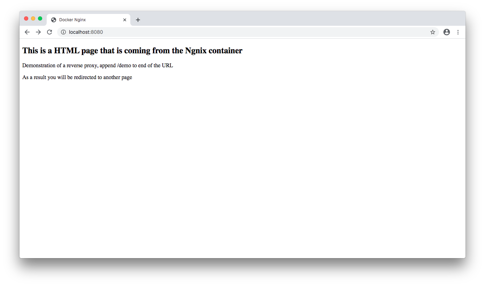
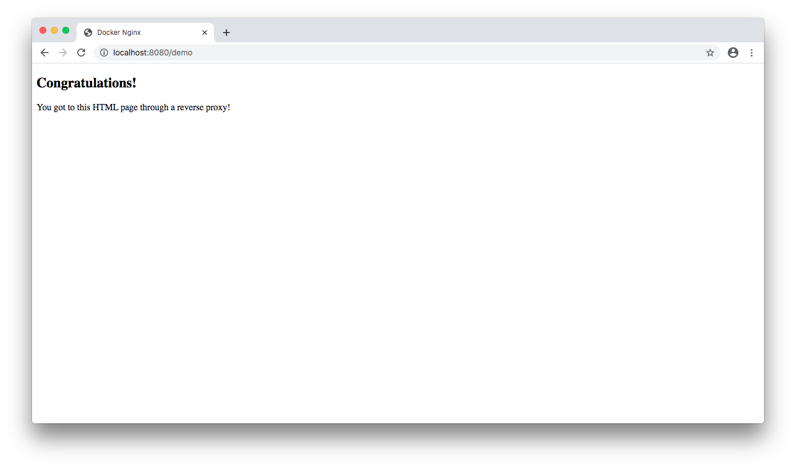
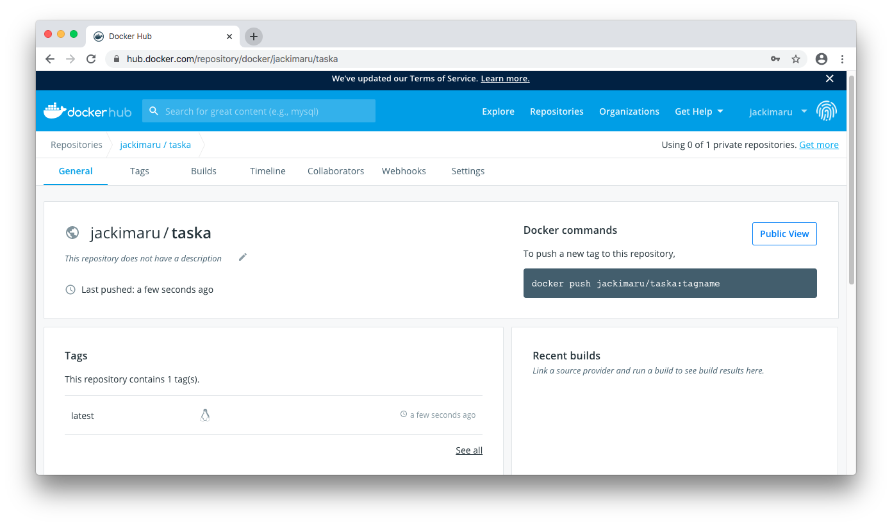

# CS3210 Assignment Task A: Docker
## Jack Chen Yu Jie

## Running Docker container
1. Fork and pull this repo into your local machine
2. Using Terminal/Bash, go to the repository directory which contains `Dockerfile`
3. Run command `docker build -t webserver` to build the image using the `Dockerfile`
4. Run `docker run -it --rm -d -p 8080:80 --name web webserver` to start container, the Docker container internal port 80 is exposed to `localmachine`'s port 8080
5. Using your favourite web browser, type in `http://localhost:8080` and this will bring you to the `index.html` of the example website

## Reverse Proxy
The Nginx webserver is able to perform a reverse proxy on requests ending with the developer's specified appended link which in this case is `\demo`.
1. Add `/demo` at the back of `http://localhost:8080`
2. The Nginx webserver will then perform a reverse proxy and redirect you to the page located at `localhost:8080/somewords/demo.html`

## Screenshots

